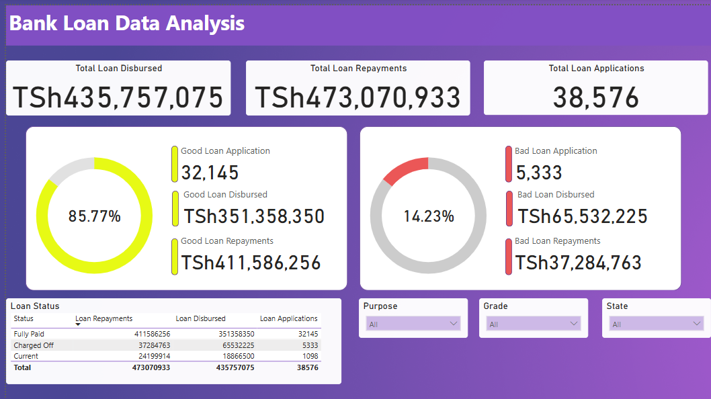

# Bank Loan Analysis using Power BI
Welcome to the Bank Loan Analysis Power BI project repository! This project aims to provide insightful analysis and visualization of bank loan data using Power BI.

### Overview
This Power BI project analyzes various aspects of bank loans to provide valuable insights for decision-making. It comprises three main dashboards: Summary, Overview, and Details.

#### Dashboard 1: Summary
Key  Performance Indicators (KPIs) Requireents
1. Total Loan Application: Calculate the total number of loan applications received during a specified period.
2. Total Disbursed Amount: Understand the total amount of funds disbursed as loans.
3. Total Loan Repayments : Calculate Loan Repaid by clients.

